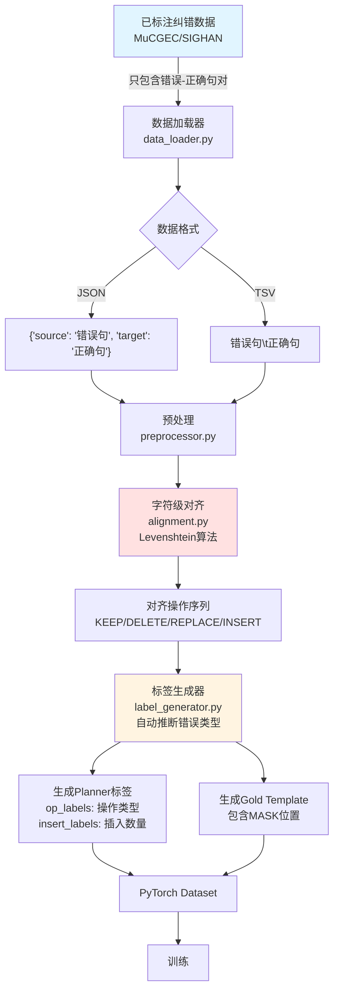
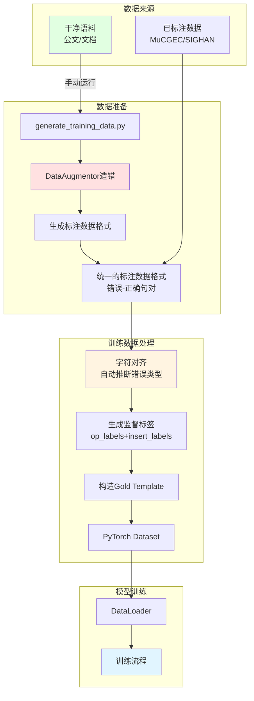

# Gap-ReLM 数据处理完整流程说明

## 核心问题解答

### 1. 为什么 `enable_augmentation` 只在config中定义但未使用？

**答案**：这是一个**设计上的独立模块**，不是自动集成的。项目提供了两种独立的数据处理工作流：

- **工作流A**：使用已标注数据（主流程，train.py自动处理）
- **工作流B**：从clean句子生成数据（需要手动运行脚本）

`enable_augmentation` 参数更多是**文档化标记**，提示用户可以使用数据增强功能，但实际需要单独调用。

---

## 两种工作流详解

### 工作流A：使用已标注数据（当前主流程）



**关键点**：
- **不需要错误类型标注**！只需要错误-正确句对
- **Levenshtein算法自动对齐**，推断出每个位置的操作类型
- 这就是为什么MuCGEC数据可以直接使用

**示例**：
```python
# 输入数据（只需要这两个）
source = "这个句子少字了"
target = "这个的句子少字了"

# Levenshtein自动对齐识别
operations = [
    KEEP("这"), KEEP("个"), 
    INSERT("的"),        # 自动识别：需要插入"的"
    KEEP("句"), KEEP("子"), ...
]

# 自动生成标签
op_labels =     [0, 0, 0, 0, 0, 0, 0]  # KEEP=0
insert_labels = [0, 1, 0, 0, 0, 0, 0]  # 在"个"后插入1个字
```

### 工作流B：从clean句子生成数据（需要手动运行）

```mermaid
graph TD
    A[干净的正确句子<br/>clean_sentences.txt] --> B[TrainingDataGenerator<br/>augmentation.py]
    
    B --> C[初始化造错组件]
    
    C --> D1[混淆集<br/>confusion_set.py<br/>形近字+音近字]
    C --> D2[保护约束<br/>protected_span.py<br/>文号/日期/金额等]
    C --> D3[ErrorGenerator<br/>error_generator.py<br/>核心造错引擎]
    
    D1 --> E[造错流程]
    D2 --> E
    D3 --> E
    
    E --> F1[步骤1: 决定是否造错<br/>概率p_corrupt=0.7]
    F1 -->|70%概率| F2[步骤2: 采样错误数量<br/>泊松分布lambda=1.5]
    F2 --> F3[步骤3: 选择错误类型<br/>π_skip/π_multiply/π_replace]
    
    F3 --> G1[删字 S 20%<br/>删除某个字符]
    F3 --> G2[重复字 M 30%<br/>重复某个字符]
    F3 --> G3[错字 R 50%<br/>用混淆字替换]
    
    G1 --> H[应用保护约束<br/>不修改重要信息]
    G2 --> H
    G3 --> H
    
    H --> I[生成错误句]
    
    I --> J[保存为训练数据<br/>{'source': '错误句', 'target': '正确句'}]
    
    J --> K[输出: train.jsonl<br/>dev.jsonl<br/>test.jsonl]
    
    K --> L[可以用工作流A训练]
    
    style A fill:#e1ffe1
    style E fill:#ffe1e1
    style K fill:#e1f5ff
```

**关键参数（4个旋钮）**：
```python
config = AugmentationConfig(
    p_corrupt=0.7,      # 旋钮1: 造错概率
    lambda_=1.5,        # 旋钮2: 平均错误数
    pi_skip=0.2,        # 旋钮3a: 删字概率
    pi_multiply=0.3,    # 旋钮3b: 重复字概率  
    pi_replace=0.5,     # 旋钮3c: 错字概率
    max_edits=4,        # 旋钮4: 最大错误数
)
```

---

## 完整的数据流转图



---

## 实际使用方法（新手指南）

### 方法1: 使用已标注数据（最简单）

```bash
# 直接训练，不需要任何数据生成步骤
python scripts/train.py \
    --train_file ./data/mucgec_train.json \
    --dev_file ./data/mucgec_dev.json \
    --data_format mucgec \
    --output_dir ./outputs
```

### 方法2: 从clean句子生成数据（需要两步）

**第1步：生成数据**
```bash
# 运行生成脚本
python scripts/generate_training_data.py
```

这会读取你的clean句子，生成：
- `./generated_data/train.jsonl`
- `./generated_data/dev.jsonl`
- `./generated_data/test.jsonl`

**第2步：用生成的数据训练**
```bash
python scripts/train.py \
    --train_file ./generated_data/train.jsonl \
    --dev_file ./generated_data/dev.jsonl \
    --data_format mucgec \
    --output_dir ./outputs
```

### 方法3: 混合使用（推荐）

```python
# 结合标注数据和生成数据
标注数据 + 生成数据 = 更好的训练效果
```

---

## 核心设计理念

### 为什么可以直接用MuCGEC？

**因为Levenshtein对齐算法可以自动推断错误类型！**

```
输入：错误句 + 正确句
    ↓
Levenshtein算法对齐
    ↓
输出：操作序列（KEEP/DELETE/REPLACE/INSERT）
    ↓
自动生成监督标签
```

这样设计的好处：
1. ✅ 不需要人工标注错误类型
2. ✅ 可以利用任何纠错数据集
3. ✅ 灵活支持各种错误类型

### 为什么数据增强是独立的？

因为：
1. **灵活性**：可以用标注数据、生成数据，或混合使用
2. **可控性**：通过参数精确控制错误类型和分布
3. **扩展性**：可以根据需要生成大量训练数据

---

## 代码示例：最简单的使用方式

```python
# 如果你有clean句子
from gap_relm.data.augmentation import TrainingDataGenerator, AugmentationConfig

# 配置
config = AugmentationConfig(p_corrupt=0.7, lambda_=1.5, seed=42)

# 创建生成器
generator = TrainingDataGenerator(config=config)

# 从文件读取clean句子
sentences = generator.load_clean_sentences("clean.txt", file_format="txt")

# 生成并保存训练数据
generator.generate_and_save(
    clean_sentences=sentences,
    output_dir="./data",
    output_format="jsonl"
)

# 然后就可以用生成的数据训练了！
```

---

## 总结

1. **`enable_augmentation`未使用**：设计上是独立模块，需要手动调用
2. **MuCGEC可直接使用**：Levenshtein算法自动推断错误类型，不需要类型标注
3. **数据生成是可选的**：可以用标注数据，也可以生成数据，或混合使用
4. **两种工作流独立**：数据生成→保存→训练加载，而不是在训练时实时生成

关键：**数据生成是前置步骤，生成后的数据格式与标注数据完全一样！**
