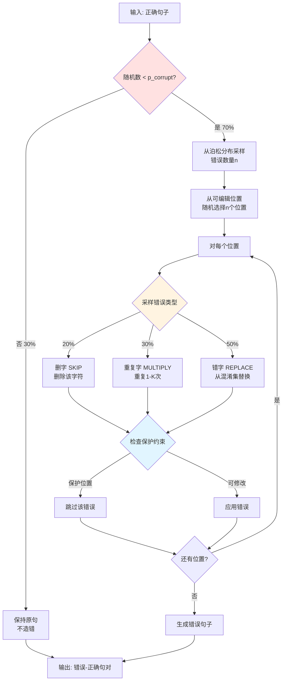
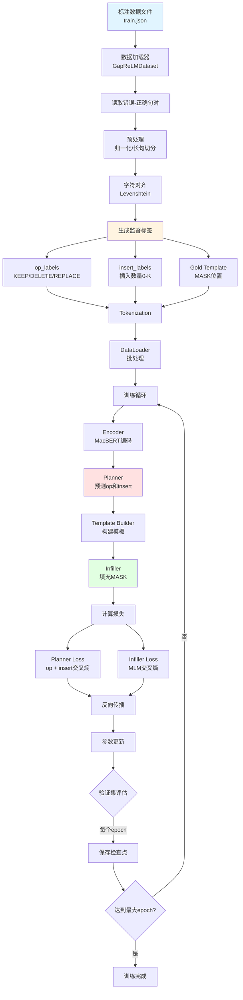

# 造错逻辑详解与训练流程完整指南

## 一、造错逻辑详解

### 核心问题解答

#### Q1: 一个原始句子只生成一个错误吗？

**答：不！一个句子可以有多个错误。**

造错流程：
```python
1. 以概率 p_corrupt (如70%) 决定是否造错
   - 如果随机数 < 0.7 → 造错
   - 否则 → 保持原句（30%保留正确句子）

2. 如果要造错，从泊松分布采样错误数量 n
   - lambda = 1.5 → 平均1.5个错误
   - 范围：1 到 max_edits (如4)
   - 采样结果可能是：1, 2, 3, 或 4 个错误

3. 随机选择 n 个不同的位置进行错误注入

4. 对每个位置，按概率选择错误类型：
   - 20% 删字
   - 30% 重复字
   - 50% 错字
```

**实际例子**：
```python
原句: "这是一个测试句子"

采样: n_edits = 3  # 从泊松分布采样到3个错误
位置: [1, 3, 5]    # 随机选择3个位置
类型: [DELETE, MULTIPLY, REPLACE]  # 每个位置随机选择类型

结果: "这一个个个测验句子"
      ↑   ↑↑↑   ↑
      删  重复  错字
```

#### Q2: 会把正确句子也加入训练集吗？

**答：会！约30%保留正确句子。**

```python
p_corrupt = 0.7  # 70%造错

# 结果：
# - 70% 的句子 → 变成错误句（有错误）
# - 30% 的句子 → 保持正确（无错误）

训练数据示例：
[
    ("这个句少字", "这个句子少字"),      # 有错误
    ("正确的句子", "正确的句子"),         # 无错误（30%）
    ("这个句句子重复", "这个句子重复"),  # 有错误
    ...
]
```

**为什么要保留正确句子？**
1. 避免过拟正（模型学会瞎改）
2. 提高精确率（减少false positive）
3. 真实场景中很多句子是正确的

#### Q3: 一个句子最多一类或一个错误吗？

**答：不！可以有多个错误，多种类型混合。**

```python
# 示例1: 多个同类错误
原句: "这是一个测试句子"
结果: "这是测试子"  # 2个删字错误（"一个"、"句"都删了）

# 示例2: 多种类型混合
原句: "中华人民共和国国务院"
结果: "中華人民共和国国国务院"
      ↑             ↑↑
      错字          重复字
# 1个错字 + 1个重复字，共2个错误

# 示例3: 复杂情况
原句: "根据宪法第六十七条规定"
结果: "根宪法第六七条条规定"
      ↑     ↑     ↑↑
      删    删    重复
# 2个删字 + 1个重复字，共3个错误
```

#### Q4: 同一个句子可能被引入不同的错误吗？

**答：在数据生成时，每个句子只生成一次（一个错误版本）。**

```python
# 数据生成阶段（generate_training_data.py）
原句: "这是一个测试句子"
  ↓
生成1次 → ("这是测试句子", "这是一个测试句子")
         # 只生成一个错误版本

# 不会生成多个版本：
# ✗ ("这是测试句子", "这是一个测试句子")
# ✗ ("这是一一个测试句子", "这是一个测试句子")
# ✗ ("这昰一个测试句子", "这是一个测试句子")
```

**但是**，如果你想从同一个句子生成多个错误版本：
```python
# 可以多次调用
for _ in range(3):  # 生成3个不同的错误版本
    result = augmentor.augment(sentence)
    print(result.corrupted)

# 输出（每次随机不同）：
# "这是测试句子"      # 删了"一个"
# "这是一个个测试句子"  # "个"重复
# "这昰一个测试句子"    # "是"→"昰"
```

### 造错算法详细流程图



### 造错示例演示

```python
# 配置参数
config = AugmentationConfig(
    p_corrupt=0.7,      # 70%造错
    lambda_=1.5,        # 平均1.5个错误
    pi_skip=0.2,        # 20%删字
    pi_multiply=0.3,    # 30%重复字
    pi_replace=0.5,     # 50%错字
    max_edits=4,        # 最多4个错误
    max_insert_k=3      # 重复最多3次
)

# 实际运行100个句子的统计
原句数量: 100
保留正确: 28 个 (28%)
造错句子: 72 个 (72%)

错误数量分布:
- 1个错误: 35 句
- 2个错误: 23 句
- 3个错误: 11 句
- 4个错误: 3 句

错误类型分布:
- 删字: 31 个
- 重复字: 44 个
- 错字: 78 个
总计: 153 个错误（平均每句2.1个）
```

---

## 二、如何使用已标注数据立即训练（工作流A）

### 最简单的训练方式

**前提**：你有 MuCGEC/SIGHAN 等标注数据

#### 步骤1: 准备数据格式

数据格式（jsonl）：
```json
{"source": "这个句子有问提", "target": "这个句子有问题"}
{"source": "根据宪法第六七条规定", "target": "根据宪法第六十七条规定"}
{"source": "正确的句子", "target": "正确的句子"}
```

或者（tsv）：
```
这个句子有问提\t这个句子有问题
根据宪法第六七条规定\t根据宪法第六十七条规定
正确的句子\t正确的句子
```

#### 步骤2: 直接训练（单卡）

```bash
python scripts/train.py \
    --train_file ./data/mucgec_train.json \
    --dev_file ./data/mucgec_dev.json \
    --test_file ./data/mucgec_test.json \
    --data_format mucgec \
    --pretrained_model hfl/chinese-macbert-base \
    --max_seq_length 128 \
    --max_insert_num 3 \
    --batch_size 32 \
    --num_epochs 10 \
    --learning_rate 2e-5 \
    --output_dir ./outputs/exp1 \
    --experiment_name mucgec_training
```

#### 步骤3: 多卡训练（推荐）

```bash
# 使用DDP多卡训练
bash scripts/run_ddp.sh
```

或者手动：
```bash
python -m torch.distributed.launch \
    --nproc_per_node=4 \
    --master_port=29500 \
    scripts/train.py \
    --train_file ./data/mucgec_train.json \
    --dev_file ./data/mucgec_dev.json \
    --data_format mucgec \
    --batch_size 64 \
    --num_epochs 10 \
    --output_dir ./outputs/exp1 \
    --use_ddp
```

### 训练流程详解



### Python API 训练（编程方式）

```python
import torch
from gap_relm.config import GapReLMConfig, get_config
from gap_relm.models import GapReLMModel
from gap_relm.data import create_data_loaders
from gap_relm.trainers import GapReLMTrainer

# 1. 加载配置
config = get_config("default")

# 修改配置
config.data.train_file = "./data/mucgec_train.json"
config.data.dev_file = "./data/mucgec_dev.json"
config.data.data_format = "mucgec"
config.training.num_epochs = 10
config.training.batch_size = 32

# 2. 创建数据加载器
train_loader, dev_loader, _, tokenizer = create_data_loaders(
    train_file=config.data.train_file,
    dev_file=config.data.dev_file,
    tokenizer_name=config.model.pretrained_model_name,
    max_seq_length=config.model.max_seq_length,
    batch_size=config.training.batch_size,
    data_format=config.data.data_format,
)

# 3. 创建模型
model = GapReLMModel(
    config=config,
    pretrained_model_name=config.model.pretrained_model_name
)

# 4. 创建训练器
trainer = GapReLMTrainer(
    model=model,
    config=config,
    train_loader=train_loader,
    dev_loader=dev_loader,
    tokenizer=tokenizer
)

# 5. 开始训练
trainer.train()

print("训练完成！")
```

### 训练中的自动处理

训练时，模型会**自动处理**：

1. **字符对齐**：自动推断错误类型
```python
# 你不需要手动对齐
输入: {"source": "这个句子少了", "target": "这个的句子少了"}
自动: Levenshtein对齐 → 识别为INSERT操作
```

2. **标签生成**：自动生成op和insert标签
```python
自动生成:
- op_labels = [0,0,0,0,0,0,0]
- insert_labels = [0,1,0,0,0,0,0]
```

3. **模板构建**：自动构建Gold Template
```python
自动构建:
template = "这个[MASK]句子少了"  # 用于训练Infiller
```

4. **批处理**：自动padding和batch化
```python
自动处理:
- input_ids: [batch, seq_len]
- attention_mask: [batch, seq_len]
- labels: [batch, seq_len]
```

### 快速开始示例

**假设你有MuCGEC数据**：

```bash
# 第1步：确认数据格式正确
head ./data/mucgec_train.json
# {"source": "错误句子", "target": "正确句子"}

# 第2步：直接开始训练
python scripts/train.py \
    --train_file ./data/mucgec_train.json \
    --dev_file ./data/mucgec_dev.json \
    --data_format mucgec \
    --batch_size 32 \
    --num_epochs 10 \
    --output_dir ./outputs

# 完成！等待训练结束
```

**训练输出示例**：
```
Loading data...
Processing 10000 samples...
100%|████████████| 10000/10000 [01:23<00:00]
Loaded 9847 samples

Training...
Epoch 1/10:
  100%|████████| 308/308 [05:42<00:00, train_loss=2.34]
  Dev F0.5: 0.543, Precision: 0.621, Recall: 0.487
  ✓ Saved checkpoint to ./outputs/checkpoint_epoch_1

Epoch 2/10:
  100%|████████| 308/308 [05:38<00:00, train_loss=1.87]
  Dev F0.5: 0.612, Precision: 0.689, Recall: 0.551
  ✓ New best! Saved checkpoint to ./outputs/best_model

...

Training complete!
Best epoch: 8
Best F0.5: 0.687
```

---

## 三、训练流程总结

### 数据处理流水线

```
标注数据(json/tsv) 
  → 读取错误-正确句对
  → Levenshtein自动对齐（推断错误类型）
  → 自动生成监督标签（op/insert/template）
  → Tokenization + 批处理
  → 送入模型训练
```

**关键：全自动！你只需要提供错误-正确句对。**

### 对比两种数据来源

| 特性 | 已标注数据（工作流A） | 生成数据（工作流B） |
|------|---------------------|-------------------|
| 数据准备 | 直接使用 | 需要运行生成脚本 |
| 错误类型 | 真实错误分布 | 可控的错误分布 |
| 数据量 | 有限（几千-几万） | 无限（只要有clean句子） |
| 质量 | 高（人工标注） | 中（规则生成） |
| 适用场景 | 评估模型性能 | 扩充训练数据 |
| 使用方式 | `--train_file mucgec_train.json` | 先生成→再训练 |

**最佳实践**：**混合使用** = 标注数据 + 生成数据

---

## 四、立即开始训练的检查清单

### ✅ 前置检查

1. **数据格式正确**：
```bash
# 检查文件内容
head -n 3 ./data/train.json
# 应该看到：
# {"source": "错误句", "target": "正确句"}
# {"source": "...", "target": "..."}
```

2. **依赖已安装**：
```bash
pip install torch transformers python-Levenshtein tensorboard tqdm
```

3. **GPU可用**（可选，CPU也能训练）：
```bash
python -c "import torch; print(torch.cuda.is_available())"
# 应该输出：True
```

### 🚀 开始训练

```bash
python scripts/train.py \
    --train_file ./data/your_train_file.json \
    --dev_file ./data/your_dev_file.json \
    --data_format mucgec \
    --output_dir ./outputs/my_exp
```

**就这么简单！** 🎉

---

## 五、常见问题

### Q: 训练很慢怎么办？
A: 使用多卡训练或减小batch_size

### Q: 内存不足怎么办？
A: 减小max_seq_length或batch_size

### Q: 如何提高F2分数？
A: 调整F2优化参数（config.f2_optimization）

### Q: 可以中断后继续训练吗？
A: 可以，使用--resume_from_checkpoint

### Q: 如何混合使用标注数据和生成数据？
A: 先生成数据，然后合并到标注数据文件中

```bash
# 合并数据文件
cat mucgec_train.json generated_train.jsonl > combined_train.json

# 训练
python scripts/train.py --train_file combined_train.json ...
```
